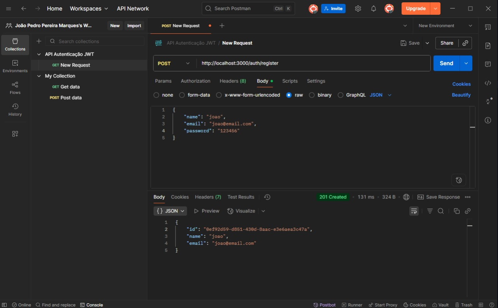
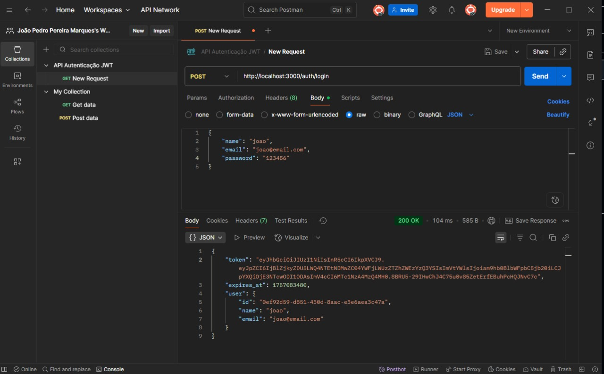

# 🚀 API de Autenticação com JWT + Redis + PostgreSQL

Projeto desenvolvido como atividade prática da disciplina **Desenvolvimento de Webservices e API**.  
Implementa um fluxo de autenticação completo com **registro, login, rotas protegidas, logout seguro com blacklist no Redis** e documentação interativa via Swagger.

---

## 📌 Funcionalidades

- ✅ Registro de usuário (`/auth/register`)
- ✅ Login com credenciais válidas (`/auth/login`)
- ✅ Rotas protegidas com JWT (`/protected/*`)
- ✅ Logout seguro com Redis (token em blacklist) (`/auth/logout`)
- ✅ Documentação interativa no Swagger (`/api-docs`)

---

## 🛠️ Tecnologias Utilizadas

- [Node.js](https://nodejs.org/) + [Express](https://expressjs.com/)
- [PostgreSQL](https://www.postgresql.org/) + [Sequelize](https://sequelize.org/)
- [Redis](https://redis.io/)
- [JWT (Json Web Token)](https://jwt.io/)
- [Docker + Docker Compose](https://www.docker.com/)
- [Swagger (OpenAPI 3.0)](https://swagger.io/)

---
## 🔑 Fluxo de Autenticação

1. **Registro**
   - `POST /auth/register` → cria usuário.
2. **Login**
   - `POST /auth/login` → retorna JWT válido.
3. **Rota protegida**
   - `GET /protected/me` → requer `Authorization: Bearer <token>`.
4. **Logout**
   - `POST /auth/logout` → token vai para a blacklist do Redis (TTL até o exp).
5. **Tentativa após logout**
   - `GET /protected/me` com o **mesmo** token → `401 Unauthorized`.

---

## 📖 Swagger

Acesse: [http://localhost:3000/api-docs](http://localhost:3000/api-docs)

Endpoints documentados:
- `/auth/register`
- `/auth/login`
- `/auth/logout`
- `/protected/me`
- `/protected/ping`

Rotas protegidas exigem header:
Authorization: Bearer <jwt_token>

---

## ✅ Prints do Fluxo (Postman)

### 1) Registro


### 2) Login (gera token)


### 3) Protected (200 OK)


### 4) Logout (token vai para a blacklist)


### 5) Protected depois do logout (401)


---

## 🖼️ Prints no Repositório

Os prints utilizados para demonstrar o fluxo também estão disponíveis na pasta:

```bash
docs/prints/
├── register.png
├── login.png
├── protected-ok.png
├── logout.png
└── protected-401.png
```

### 1. Clonar o repositório

```bash
git clone https://github.com/LeiteLimaPedro/atividade-fluxo-api.git
cd atividade-fluxo-api
